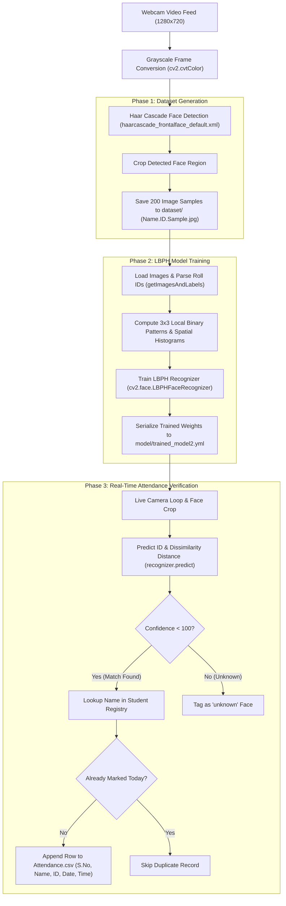

# 👤 Face Detection Based Attendance System

[](https://chresko08.github.io/face_detection_based_attendance/)
[](https://www.python.org/)
[](https://opencv.org/)
[](https://docs.python.org/3/library/tkinter.html)
[](#-algorithmic-deep-dive)
[](LICENSE)

An automated, contactless biometric attendance management system powered by **Computer Vision** and **Machine Learning**. Utilizing **OpenCV Haar Cascade Classifiers** for real-time frontal face detection and **Local Binary Patterns Histograms (LBPH)** for facial texture feature extraction and identification, this system streamlines attendance tracking, prevents duplicate entries, and commits verified records to a timestamped CSV ledger.

---

## 🌐 Live Demo & Deployment

- **GitHub Pages Live Deployment:**  
  👉 **[https://chresko08.github.io/face_detection_based_attendance/](https://chresko08.github.io/face_detection_based_attendance/)**
- **Source Code Repository:**  
  📂 **[https://github.com/Chresko08/face_detection_based_attendance](https://github.com/Chresko08/face_detection_based_attendance)**

> [!NOTE]
> The GitHub Pages web portal includes an **interactive in-browser simulator** allowing users to test sample collection, LBPH model training, real-time face verification with webcam integration, and live CSV export directly from their browser without needing local installations.

---

## 📑 Table of Contents

- [🌐 Live Demo & Deployment](#-live-demo--deployment)
- [✨ Key Features](#-key-features)
- [🏗️ System Architecture & Workflow](#️-system-architecture--workflow)
- [🔬 Algorithmic Deep Dive](#-algorithmic-deep-dive)
  - [1. Face Detection: Viola-Jones Haar Cascade](#1-face-detection-viola-jones-haar-cascade)
  - [2. Face Recognition: Local Binary Patterns Histograms (LBPH)](#2-face-recognition-local-binary-patterns-histograms-lbph)
- [📁 Project Structure & File Analysis](#-project-structure--file-analysis)
  - [FinalProject Directory](#finalproject-directory)
  - [Old Files Directory (Evolutionary Prototypes)](#old-files-directory-evolutionary-prototypes)
- [💻 Hardware & Software Requirements](#-hardware--software-requirements)
- [🚀 Getting Started & Installation](#-getting-started--installation)
- [📖 Step-by-Step Operational Walkthrough](#-step-by-step-operational-walkthrough)
- [📊 Output Attendance Format](#-output-attendance-format)
- [🗺️ Future Roadmap & Enhancements](#️-future-roadmap--enhancements)
- [👤 Author & Credits](#-author--credits)

---

## ✨ Key Features

- **Automated Sample Capture:** Collects up to 200 cropped grayscale face frames per user directly from webcam input with bounding-box guidance.
- **Robust Feature Training:** Fits OpenCV's LBPH Face Recognizer on labeled spatial histograms, generating a reusable YAML model (`model/trained_model2.yml`).
- **Real-Time Video Inference:** Continuously analyzes live camera frames at $1280 \times 720$, predicting subject identity and overlaying matching confidence scores ($0-100\%$).
- **Smart Duplicate Prevention:** Automatically checks `Attendance.csv` during session runtime to ensure a student is logged only once per attendance session.
- **Native Desktop GUI:** Built with Python `tkinter`, featuring custom background artwork (`Image.png`), integer validation on Roll Number inputs, status notifications, and graphical buttons.
- **Relational DBMS Roadmap:** Includes relational SQL schemas (`employee_database.sql`) demonstrating enterprise scalability beyond flat CSV tables.

---

## 🏗️ System Architecture & Workflow



---

## 🔬 Algorithmic Deep Dive

### 1. Face Detection: Viola-Jones Haar Cascade
The system uses the pre-trained `haarcascade_frontalface_default.xml` classifier based on the Viola-Jones framework:
- **Integral Image Representation:** Transforms pixel intensities so rectangular box sums can be evaluated in $O(1)$ constant time.
- **Haar-like Features:** Evaluates contrast differences between adjacent dark and light rectangular regions (e.g., eye sockets are darker than bridge of the nose and cheeks).
- **AdaBoost Feature Selection:** Filters over 160,000 candidate rectangle combinations down to the top discriminative features.
- **Cascade of Classifiers:** Chains stages of weak learners; background regions are rejected in early stages, reserving computational cycles for candidate face regions.
- **Hyperparameter Configuration:**
  - `scaleFactor=1.2` or `1.3`: Determines the percentage reduction in window size between scale levels.
  - `minNeighbors=5`: Specifies how many candidate neighbor rectangles must overlap to confirm a valid detection, eliminating false positives.

### 2. Face Recognition: Local Binary Patterns Histograms (LBPH)
Unlike Eigenfaces or Fisherfaces which view facial features holistically and suffer under uneven lighting, **LBPH** is a local texture descriptor:
1. **Neighborhood Thresholding:** For every pixel $(x_c, y_c)$, its 8 adjacent neighbor pixels are thresholded against its center intensity:
   $$\text{LBP}(x_c, y_c) = \sum_{p=0}^{7} s(i_p - i_c) 2^p \quad \text{where} \quad s(x) = \begin{cases} 1 & \text{if } x \ge 0 \\ 0 & \text{if } x < 0 \end{cases}$$
2. **Spatial Grid Subdivision:** The cropped face is partitioned into local sub-regions (e.g., $8 \times 8$ cells) to retain spatial arrangement of eyes, nose, and mouth.
3. **Histogram Generation & Concatenation:** Histograms of binary patterns are calculated for each grid cell and concatenated into an integrated feature vector.
4. **Dissimilarity Metric & Distance:** Probe images are matched against stored histograms using **Chi-Square Distance**:
   $$\chi^2(H_{\text{probe}}, H_{\text{train}}) = \sum_{i} \frac{(H_{\text{probe}}(i) - H_{\text{train}}(i))^2}{H_{\text{probe}}(i) + H_{\text{train}}(i)}$$
   - A distance of `0` denotes an exact match.
   - Distances below `100` are validated as positive matches and converted into percentage confidence: `100 - confidence`.

---

## 📁 Project Structure & File Analysis

```
face_detection_based_attendance/
├── FinalProject/                           # Production desktop application
│   ├── App_Train_model.py                  # Core Tkinter GUI & OpenCV execution pipeline
│   ├── Attendance.csv                      # Persistent attendance log file
│   ├── haarcascade_frontalface_default.xml # Default Viola-Jones frontal face detector
│   ├── haarcascade_frontalface_alt.xml     # Alternate Haar cascade model
│   ├── requirements.txt                    # Project package dependencies
│   ├── Image.png                           # 1280x720 GUI background artwork
│   └── images/                             # Graphical interface button assets
│       ├── button_take-image.png           # 'Take Image' button
│       ├── button_train-images.png         # 'Train Images' button
│       ├── mark_attendance.png            # 'Mark Attendance' button
│       └── button_quit.png                 # 'Quit' button
├── Old Files/                              # Research prototypes and database scripts
│   ├── training_module.py                  # CLI image collection script
│   ├── testing_module.py                   # Experimental script testing dlib face_recognition
│   ├── employee_database.sql               # Relational SQL schema with employees, projects, dept
│   └── commands.txt                        # Git development shortcuts and aliases
├── index.html                              # GitHub Pages interactive web demo & showcase
└── README.md                               # Detailed project documentation
```

### FinalProject Directory
- **[`FinalProject/App_Train_model.py`](file:///Users/shubhamsrivastava/Documents/face_detection_based_attendance/FinalProject/App_Train_model.py):**  
  Main entry point. Houses the Tkinter application, webcam video loops, Haar cascade face localization, LBPH training routines, and CSV write operations.
- **[`FinalProject/Attendance.csv`](file:///Users/shubhamsrivastava/Documents/face_detection_based_attendance/FinalProject/Attendance.csv):**  
  The persistent ledger tracking attendance with schema: `S.No.,Name,Roll.No.,Date,Time`.
- **[`FinalProject/haarcascade_frontalface_default.xml`](file:///Users/shubhamsrivastava/Documents/face_detection_based_attendance/FinalProject/haarcascade_frontalface_default.xml):**  
  Standard OpenCV XML model for human frontal face detection.
- **[`FinalProject/requirements.txt`](file:///Users/shubhamsrivastava/Documents/face_detection_based_attendance/FinalProject/requirements.txt):**  
  Standard pip specification of dependencies (`opencv-contrib-python`, `pillow`, `pandas`, `numpy`).

### Old Files Directory (Evolutionary Prototypes)
- **[`Old Files/training_module.py`](file:///Users/shubhamsrivastava/Documents/face_detection_based_attendance/Old%20Files/training_module.py):**  
  Early script that tested webcam frame dimensions ($1280 \times 720$), horizontal mirroring (`cv2.flip(frame, 1)`), and saving images into roll-number subdirectories.
- **[`Old Files/testing_module.py`](file:///Users/shubhamsrivastava/Documents/face_detection_based_attendance/Old%20Files/testing_module.py):**  
  Experimental prototype testing the `face_recognition` (dlib) library for deep metric face encodings.
- **[`Old Files/employee_database.sql`](file:///Users/shubhamsrivastava/Documents/face_detection_based_attendance/Old%20Files/employee_database.sql):**  
  Enterprise relational schema (`employee`, `department`, `dept_locations`, `project`, `works_on`, `dependent`) with foreign keys, sample corporate data, and analytical SQL queries.

---

## 💻 Hardware & Software Requirements

- **Operating System:** Windows 10/11, macOS (Apple Silicon / Intel), or Linux (Ubuntu 20.04+)
- **Python:** Python 3.7 to 3.11
- **Camera:** Standard integrated 720p/1080p webcam or external USB camera
- **RAM:** Minimum 2 GB RAM (4 GB recommended)

---

## 🚀 Getting Started & Installation

### Step 1: Clone the Repository
```bash
git clone https://github.com/Chresko08/face_detection_based_attendance.git
cd face_detection_based_attendance
```

### Step 2: Set Up Virtual Environment (Recommended)
```bash
# On macOS / Linux:
python3 -m venv venv
source venv/bin/activate

# On Windows:
python -m venv venv
venv\Scripts\activate
```

### Step 3: Install Required Dependencies
Ensure you install `opencv-contrib-python` (which contains the `cv2.face` module required by LBPH):
```bash
pip install -r FinalProject/requirements.txt
```

> [!TIP]
> If installing packages manually, execute:
> ```bash
> pip install opencv-python opencv-contrib-python pillow numpy pandas
> ```

### Step 4: Run the Application
Navigate into the `FinalProject` directory and execute:
```bash
cd FinalProject
python3 App_Train_model.py
```

---

## 📖 Step-by-Step Operational Walkthrough

```
+-------------------------------------------------------------+
|               UGI, Face Recognition System                  |
+-------------------------------------------------------------+
|                                                             |
|   Enter Roll No: [ 1734210087        ]                      |
|                                                             |
|   Enter Name:    [ Shubham Srivastava ]                     |
|                                                             |
|   [Take Image]    [Train Images]   [Mark Attendance]  [Quit]|
+-------------------------------------------------------------+
```

1. **Step 1: Register New Subject & Take Images**
   - Enter numeric **Roll No** in the first field (non-digit characters are automatically rejected).
   - Enter the student's **Name** in the second field.
   - Click **Take Image**: The webcam activates and captures 200 face frames into the `dataset/` directory. Press `q` to terminate early.
2. **Step 2: Train Model**
   - Click **Train Images**: The system aggregates all cropped faces in `dataset/`, trains the LBPH classifier, and exports the serialized model to `model/trained_model2.yml`.
   - The status bar updates to: `Model Trained`.
3. **Step 3: Mark Attendance**
   - Click **Mark Attendance**: The camera opens in live recognition mode.
   - Bounding boxes will outline detected faces in green, displaying the recognized student's name and similarity score.
   - When confidence is verified ($confidence < 100$), the system logs the student's roll number, name, date, and timestamp into `Attendance.csv`.
   - Press <kbd>ESC</kbd> to exit camera mode.
4. **Step 4: Quit**
   - Click **Quit** to safely close the application.

---

## 📊 Output Attendance Format

Attendance records are automatically appended to [`FinalProject/Attendance.csv`](file:///Users/shubhamsrivastava/Documents/face_detection_based_attendance/FinalProject/Attendance.csv):

| S.No. | Name | Roll.No. | Date | Time |
| :---: | :--- | :---: | :---: | :---: |
| 1 | Shubham Srivastava | 1734210087 | Oct-03-2026 | 09:14:22 |
| 2 | Ananya Sharma | 1734210045 | Oct-03-2026 | 09:16:05 |
| 3 | Rahul Verma | 1734210092 | Oct-03-2026 | 09:18:40 |

---

## 🗺️ Future Roadmap & Enhancements

- [ ] **Deep Learning Facial Embeddings:** Incorporate FaceNet, MobileFaceNet, or InsightFace (ArcFace) for higher accuracy under extreme angles and occlusions.
- [ ] **Liveness & Anti-Spoofing Detection:** Integrate eye-blink tracking, head-pose estimation, or depth sensors to prevent spoofing with printed photos or phone screens.
- [ ] **Cloud & Relational Database Integration:** Transition from local CSV files to cloud DBMS (PostgreSQL / Supabase / Firebase) based on the relational schema in `Old Files/employee_database.sql`.
- [ ] **Admin Analytics Dashboard:** Web-based teacher dashboard with visual attendance charts, export to XLSX/PDF, and automated notifications for absentees.

---

## 👤 Author & Credits

- **Developer:** [Shubham Srivastava (Chresko08)](https://github.com/Chresko08)
- **Institution:** United Group of Institutions (UGI) / MNNIT Allahabad
- **Project Repository:** [face_detection_based_attendance](https://github.com/Chresko08/face_detection_based_attendance)
- **Live Showcase:** [https://chresko08.github.io/face_detection_based_attendance/](https://chresko08.github.io/face_detection_based_attendance/)
